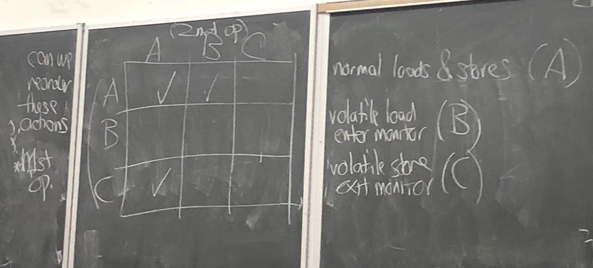

# Lecture 9 - Java Memory Model

## "as if" rule

The Standard of Java contains a lot of rules. THe implementation of the language can disregard the rules, so long as the language behavior is as if it follows the rules.

**Example**: 

```java
f(g(), h(i + i));

int g() {
  int x = 0;
  return x;
}

int h(x, y) {
  return 0 + 1;
}
```

For function application, the java standard dictates that:

1. All arguments evaluated before `f` starts
1. Arguments must be evaluated in order

```java
// Thread 1
int n1 = n;
n1++;
n = n1;
if (n != n1) {
  trouble();
}

// Thread 2
int n2= n;
n2++;
n = n2;
if (n != n2) {
  trouble();
}
```

The compiler will optimize it and remove the if statement because in single-thread model the condition will always be wrong. However, this assumption is not true in multi-thread model.

## Volatile

Used for:
Machine register
Geiger counter
...

Now, compiler will view every access of the variable as viewable and would make the optimization if the number and order of variable access is held invariant.

```java
int dcreg;
dcreg = 27;
dcreg = 5196;
```

will be optimized into

```java
int dcreg = 5196;
```

```java
int gcct;
int n0 = gcct;
sleep(1);
int n1 = gcct;
printf("%d", n1 - n0);
```

will be optimized into

```java
sleep(1);
printf("%d", 0);
```

How to solve this problem? Add the volatile keyword.

```java
int volatile dcreg;
dcreg = 27;
dcreg = 5196;
```

## synchronized

```java
synchronized {

}
```

The key word `synchronized` followed by a block surrounded by curly brackets define a synchronized block. All synchronized blocks synchronized on the same object can only have one thread executing inside them at the same time. All other threads attempting to enter the synchronized block are blocked until the thread inside the synchronized block exits the block.

```java
synchronized {
  ox = oy + 1;
}

// a potential implementation can be

while (this.locked) {
  continue;
}
this.locked = true; // must be atomic
ox = oy + 1;
o.locked = false; // must be atomic
```

## Reorder table

